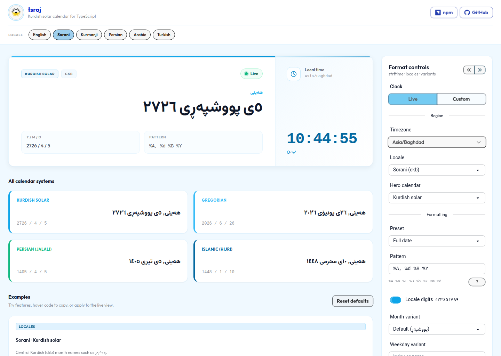

# tsroj — Kurdish Solar Calendar

**tsroj** is a TypeScript library for the Kurdish **solar** calendar. Convert and format dates across **Kurdish solar**, **Gregorian**, **Persian (Jalali)**, and **Tabular Islamic** systems using only native JavaScript (`Date`, `Math`) — **zero runtime dependencies**.

[](https://www.npmjs.com/package/@0xdolan/tsroj)
[](LICENSE)

- **Package**: [@0xdolan/tsroj on npm](https://www.npmjs.com/package/@0xdolan/tsroj)
- **Repository**: [github.com/0xdolan/tsroj](https://github.com/0xdolan/tsroj)
- **Live demo**: [0xdolan.github.io/tsroj](https://0xdolan.github.io/tsroj/)
- **Year range**: `1..9999` (aligned with native limits)
- **Week start**: Saturday (Kurdish / Persian convention)

## Install

```bash
npm i @0xdolan/tsroj
```

```bash
pnpm add @0xdolan/tsroj
```

```bash
yarn add @0xdolan/tsroj
```

## Quick start

```typescript
import { KurdishDate, KurdishDateTime } from "@0xdolan/tsroj";

// From Gregorian
const kd = KurdishDate.fromGregorian(new Date(2026, 5, 26));
console.log(kd.year, kd.month, kd.day); // 2726, 4, 5

// Native Kurdish date
const native = new KurdishDate(2726, 4, 5);

// Conversions
console.log(native.toGregorian()); // [2026, 6, 26]
console.log(native.toPersian());   // [1405, 4, 5]
console.log(native.toIslamic());   // [1448, 1, 10]

// Date + time
const now = KurdishDateTime.now();
console.log(now.strftime("%I:%M %p", { locale: "ckb" }));
```

## Locales & calendars

Supported locale codes: `en`, `ckb` (Sorani), `kmr` (Kurmanji), `fa`, `ar`, `tr`.

Dialect aliases (`sdh`, `lki`, `zza`, `ku`, …) resolve to the nearest loaded bundle (`ckb` or `kmr`).

| Calendar   | Month names from |
|-----------|------------------|
| Kurdish solar | User locale bundle |
| Gregorian     | User locale bundle |
| Persian       | Canonical `fa` bundle |
| Islamic       | Canonical `ar` bundle |

Locale data lives under `src/locales/<code>/common.json` with i18next-style variant groups (`names`, `short`, `min`).

## Formatting (`strftime`)

```typescript
const kd = new KurdishDate(2726, 4, 5);

// Sorani month names (month 4 = پووشپەڕ)
kd.strftime("%B", { locale: "ckb" }); // پووشپەڕ

// Month / weekday variants (index or exact name)
kd.strftime("%B %b", { locale: "ckb", monthVariant: 1 });
kd.strftime("%A %a %E", { locale: "kmr", weekdayVariant: 1 });

// Locale digits
kd.strftime("%Y", { locale: "ckb", useLocaleDigits: true }); // ٢٧٢٦

// Manual overrides (highest priority)
kd.strftime("%B %A", {
  locale: "ckb",
  month: "CustomMonth",
  weekday: "CustomDay",
});
```

### Sorani ezafe (ی) — `ckb` only

Enabled by default; disable per option:

| Option | When | Example |
|--------|------|---------|
| `ezafeAfterDay` | Day + month name in pattern | `5ی پووشپەڕ` |
| `ezafeOnMonth` | Day + month name + year in pattern | `5ی پووشپەڕی 2726` |

```typescript
kd.strftime("%d %B %Y", { locale: "ckb" });
// 5ی پووشپەڕی 2726

kd.strftime("%d %B %Y", {
  locale: "ckb",
  ezafeAfterDay: false,
  ezafeOnMonth: false,
});
// 5 پووشپەڕ 2726
```

### Leading zero — `ckb`, `fa`, `ar`

`leadingZero` defaults to **`false`** for these locales (`%d`, `%m`, and time tokens omit padding). Set `leadingZero: true` to pad.

```typescript
kd.strftime("%d/%m", { locale: "ckb" }); // 5/4
kd.strftime("%d/%m", { locale: "en" });  // 05/04
```

### strftime tokens

`%A` `%a` `%E` (weekday min) `%B` `%b` `%Y` `%y` `%m` `%-m` `%d` `%-d` `%w` `%-w` `%H` `%I` `%M` `%S` `%p`

### `FormatCalendarOptions`

| Option | Description |
|--------|-------------|
| `locale` | Locale code |
| `calendar` | `kurdish` · `gregorian` · `persian` · `islamic` |
| `monthVariant` | Month variant index or exact name |
| `weekdayVariant` | Weekday variant index or exact name |
| `useLocaleDigits` | Use locale digit glyphs |
| `leadingZero` | Pad numeric tokens (default off for ckb/fa/ar) |
| `ezafeAfterDay` | Sorani ی after day (default on for ckb) |
| `ezafeOnMonth` | Sorani ی on month when year present (default on for ckb) |
| `month`, `weekday`, … | Manual label overrides |
| `overrides` | Nested override object |

## Interactive demo

```bash
npm run build          # build library (updates dist types for demo)
cd demo && npm install && npm run dev
```

Open **http://localhost:5173/tsroj/** — live clock, four calendar systems, searchable timezone picker, locale variants, Sorani grammar toggles, and copyable examples.

Deployed at **https://0xdolan.github.io/tsroj/**.

<p align="center">
  <a href="https://0xdolan.github.io/tsroj/">
    
  </a>
</p>

<p align="center"><sub>To embed on your own site (after deploy), use:<br><code>&lt;iframe src="https://0xdolan.github.io/tsroj/" title="tsroj demo" width="100%" height="820" loading="lazy"&gt;&lt;/iframe&gt;</code></sub></p>

## Development

```bash
npm run test    # Vitest
npm run lint    # TypeScript + Biome
npm run build   # tsup → dist/
```

Branch flow: `feature/*` → `develop` → `main`.

## Security

Static locale JSON only — no `eval()`, no prototype pollution vectors. See [SECURITY.md](SECURITY.md).

## License

[GPL-3.0](LICENSE)
